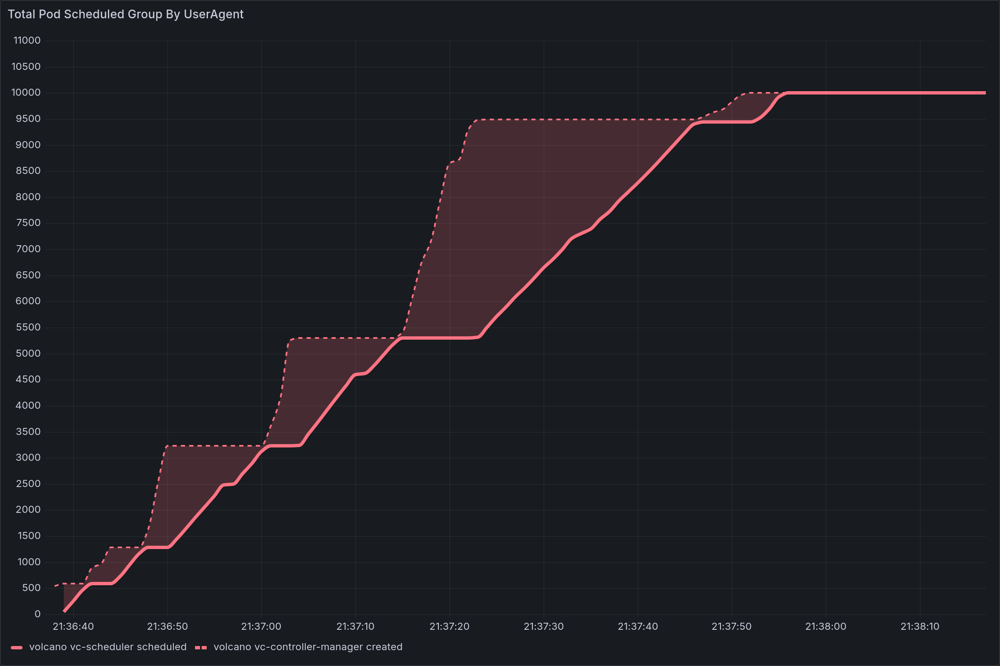
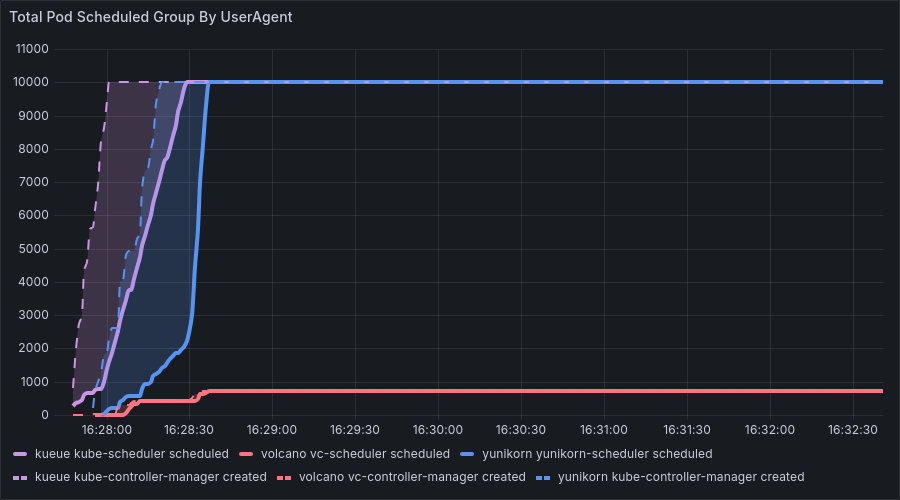
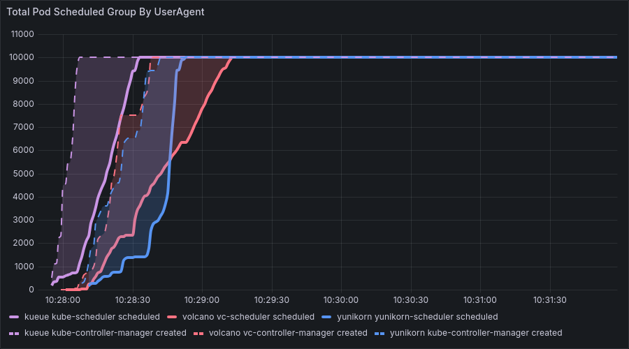
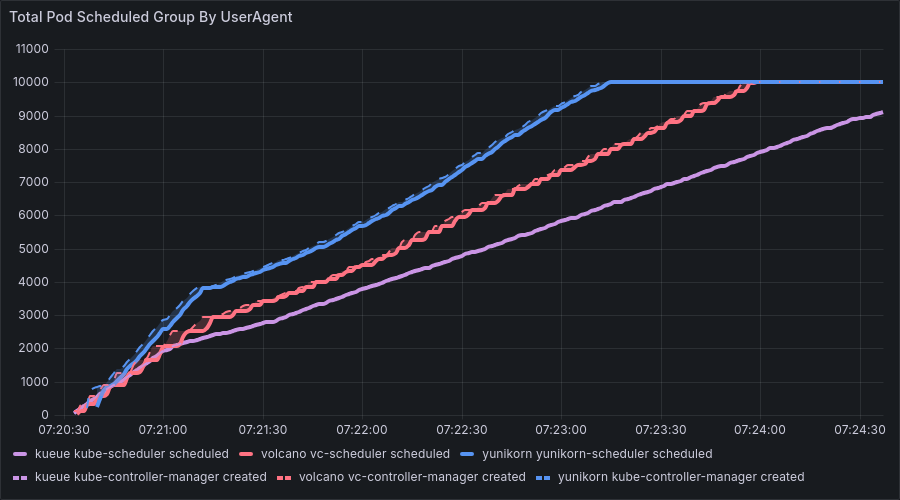
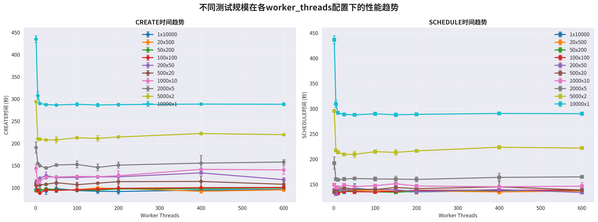
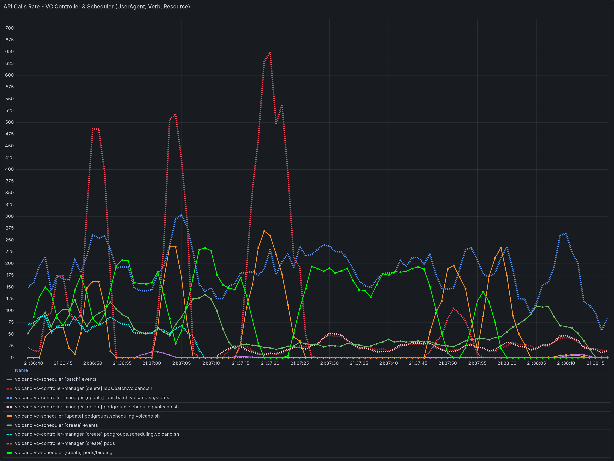

# How to Tune Volcano Performance in Large-Scale Scenarios

> This article originates from the "Volcano Large-Scale Performance Testing and Tuning" project of the Open Source Promotion Plan (OSPP), organized by the Chinese Academy of Sciences. All experimental data and analysis have been published in the author's blog series (@Freshwlnd).

## 1. Introduction

### 1.1 Background and Objectives

Volcano is a mainstream cloud-native batch processing system widely used in AI, big data, and HPC scenarios. This project aims to systematically reproduce and identify performance bottlenecks in Volcano under a load of tens of thousands of pods through large-scale performance testing, ultimately producing a practical tuning guide and proposing future architectural optimization directions.

### 1.2 Summary of Overall Conclusions

Through systematic experiments, we have reached the following core conclusions:

1.  **Scenario-Dependent Performance**: Volcano's performance is highly dependent on the scheduling scenario. **When Gang Scheduling is enabled, its performance far exceeds that of other schedulers**, highlighting its core advantages in batch processing and AI scenarios. Under the general scenario where Gang is not enabled, due to the additional overhead it brings to the Job management function designed for complex scenarios, there is still some room for optimization.
2.  **Webhook as the Main Bottleneck**: In large-scale, resource-constrained clusters, the default Webhook configuration (10s timeout) is the direct cause of large-scale pod creation failures. Additionally, the overhead introduced by the Webhook validation chain itself is a significant performance factor.
3.  **Optimal Value for Controller Worker Threads**: The `--worker-threads` parameter is not a case of "the higher, the better." An improper configuration can degrade performance by saturating computing resources or exacerbating API-Server contention, exhibiting a "V-shaped" performance curve.
4.  **API-Server Contention between CREATE/SCHEDULE**: In high-concurrency scenarios, concurrent write operations to the K8s API-Server/ETCD by the Controller (CREATE) and Scheduler (SCHEDULE) lead to queuing/retries and a macroscopic phenomenon of "stair-step stalls" where they appear to execute alternately. Meanwhile, blindly increasing the `CREATE` rate may actually prolong the overall scheduling time.

## 2. Test and Monitoring Environment Description

The core of this testing was to extend the open-source `kube-scheduling-perf` framework to simulate large-scale pod scheduling scenarios in a local Kind cluster. We have conducted a detailed source code analysis of this testing framework and written a blog series titled "Cloud-Native Batch Scheduling in Practice: Volcano Monitoring and Performance Testing," available on the author's blog (@Freshwlnd).

*   **Testing Framework**: The `wzshiming/kube-scheduling-perf` project uses a Makefile for automated orchestration, enabling one-click cluster setup, execution of multi-scenario benchmarks, monitoring data collection, and results archiving.
*   **Data Collection**: The framework uses `audit-exporter` to accurately capture timestamps of `Pod Creation` and `Pod Schedule` events from the `kube-apiserver` audit logs (`audit.log`).
*   **Core Metrics**:
    *   **X-axis**: Test run time (seconds).
    *   **Y-axis**: Cumulative number of Pods that have completed `CREATE` or `SCHEDULE`.
    *   **Curve Slope**: Represents instantaneous throughput (Pods per second), a key performance metric.
    *   **Illustrative Example**:



## 3. Performance Phenomena

### 3.1 Core Performance Phenomena

In summary, we observed the following performance characteristics during our tests.

- When Gang Scheduling was not enabled, we observed unique performance characteristics in Volcano:

  1.  **Throughput and Stair-Step Stalls**: The `CREATED` and `SCHEDULED` curves exhibit a distinct stair-step pattern, with alternating periods of "surges" and "stalls."

  2.  **Large-Scale Pod Creation Failures**: In some cases, when the number of pods within a single job is very large (e.g., 20 Jobs × 500 Pods), fewer than 2,000 pods were successfully created under the default configuration.

    

- Enabling Gang Scheduling is Volcano's core use case. In this scenario:

  1.  **Superior Performance**: Volcano significantly outperforms other schedulers, thanks to its efficient PodGroup management and Gang scheduling algorithm.
  2.  **Necessary Overhead**: Although all schedulers experience longer total runtimes with Gang Scheduling due to more complex computations, Volcano's architecture maintains the highest efficiency. This validates the necessity and sophistication of its job management features. It is essential to provide adequate resources for Volcano in production environments to leverage its full capabilities.

### 3.2 Analysis of Specific Performance Phenomena

With a total of 10k pods, we adjusted the number of jobs and the number of pods per job, both with and without Gang Scheduling enabled. We focused primarily on the non-Gang Scheduling scenario.

#### Test Environment Description

**Test Environment Configuration**:
- **Hardware**: Intel Xeon Gold 6230 @ 2.10GHz, 8-core CPU, 15GB RAM, 79GB Storage
- **Software**: Docker 27.5.1, Kubernetes 1.32.2 (Kind cluster), kubectl v1.33.2
- **Test Scale**: A single test result occupied 1.3GB-2.7GB of storage, totaling 15GB of test data.
- **Comparative Verification**: Comparative tests were conducted in a high-configuration environment (24-core CPU, 96GB RAM) to verify the impact of hardware resources on the results.

**Test Methodology**:
- Extended tests were based on the open-source `kube-scheduling-perf` framework.
- `audit-exporter` was used to accurately capture `Pod Creation` and `Pod Schedule` events from `kube-apiserver` audit logs.
- Validation analysis was performed by comparing results with the video from the KubeCon Europe 2025 tech talk "A Comparative Analysis of Kueue, Volcano, and YuniKorn - Wei Huang, Apple & Shiming Zhang, DaoCloud".

#### Test Results Analysis

Without Gang Scheduling, we observed Volcano's unique performance characteristics across four typical benchmark combinations (all with a total of 10,000 pods):

##### Benchmark 1: 10,000 Jobs × 1 Pod/Job
*   **Observation**: The `CREATE` and `SCHEDULE` curves almost completely overlapped, and the overall slope (throughput) was lower compared to scenarios with fewer Jobs, mainly due to the overhead of complex job management features. The results were the same in both low and high-resource environments.
*   **Conclusion**: In this scenario, the processing overhead of the Job objects themselves is substantial, making the **pod creation (CREATE) phase the absolute performance bottleneck**.

##### Benchmark 2: 500 Jobs × 20 Pods/Job
*   **Observation**: The `SCHEDULED` curve significantly lagged behind the `CREATED` curve, and both curves showed the clearest **stair-step stall** pattern. Volcano exhibited periodic surges in both CREATED and SCHEDULE phases, indicating intermittent stalls in the controller. The results were the same in both low and high-resource environments.
*   **Conclusion**: The scheduling (SCHEDULE) phase became the bottleneck, and the resource contention between the Controller and Scheduler was most prominent.

##### Benchmark 3 & 4: 20 Jobs × 500 Pods/Job & 1 Job × 10,000 Pods/Job
*   **Observation**: The `CREATED` curve rose rapidly at the beginning and then flattened, while the `SCHEDULED` curve grew slowly and linearly, with a huge gap between them. The stair-step stall pattern in the `CREATED` curve disappeared. In our resource-limited local test environment (8-core, 16GB), a large number of pod creation failures were observed.
*   **Conclusion**: When the total number of jobs is small and the number of pods per job is extremely large, the Controller can create pods very quickly, making the **scheduling (SCHEDULE) phase the absolute performance bottleneck**.

**Key Finding**: In all four cases, Volcano's total scheduling time was roughly proportional to the number of Jobs, indicating that its performance bottleneck is primarily caused by Job processing.

## 4. Performance Bottleneck Hypotheses and Verification

### 4.1 Hypothesis 1: Webhook is a Performance Bottleneck

#### 4.1.1 Verification (Timeout Issue)

By analyzing `audit.log`, we found that a large number of pod creation failures were due to an insufficient Webhook `timeoutSeconds` (10s). The evidence includes:

- **Pod Creation Failure Rate**: 98.7% of pod creation requests failed due to timeouts.
- **Log Evidence**: 4.9GB of audit logs recorded a massive number of timeout errors.
- **Timeout Configuration**: The webhook timeout was set to 10 seconds.

Specifically, we analyzed the 4.9GB audit log with the following commands:

```bash
# Count the number of errors
grep -c "context deadline exceeded" kube-apiserver-audit.volcano.log
# Output: 520120

# Count the number of Webhook calls
grep -c "validatepod.volcano.sh" kube-apiserver-audit.volcano.log
# Output: 515531

# Count the number of successful/failed pod creations
grep -c "ResponseComplete.*pods.*create.*Success" kube-apiserver-audit.volcano.log
# Output: 712
grep -c "ResponseComplete.*pods.*create.*Failure" kube-apiserver-audit.volcano.log
# Output: 520518
```

Analyzing the error messages in the logs revealed a consistent pattern:

```json
{
  "status": "Failure",
  "message": "Internal error occurred: failed calling webhook \"validatepod.volcano.sh\": failed to call webhook: Post \"https://volcano-admission-service.volcano-system.svc:443/pods/validate?timeout=10s\": context deadline exceeded",
  "reason": "InternalError",
  "code": 500
}
```

The statistical summary is as follows:

| Metric | Count | Percentage |
|---|---|---|
| **Total Pod Creation Requests** | 526,767 | 100% |
| **Successful Creations** | 712 | 0.13% |
| **Failed Creations** | 520,518 | 98.7% |
| **Webhook Timeout Errors** | 520,120 | 98.7% |

**Experimental Design**: To verify this hypothesis, we increased the webhook timeout from 10 seconds to 30 seconds:

```bash
# Batch modify the timeout in all webhook configuration files
sed -i 's/timeoutSeconds: 10/timeoutSeconds: 30/g' schedulers/volcano/admission-service-*.yaml
```

**Verification Result**: After increasing the timeout to 30s, the number of pod creations returned to normal. In benchmark 3 and 4, the number of created pods recovered from "less than 1000" to the normal state of "10,000", and the pod creation success rate increased from 1.3% to nearly 100%.

Before fix:



After fix:



#### 4.1.2 Verification (Inherent Overhead)

Even after resolving the timeout issue, the complex validation process of the Webhook (TLS, network transport) itself introduces overhead. Specifically, Volcano's Webhook system includes multiple components, and each pod creation request must pass through:

1.  **Mutating Webhook**: Modifies Pod configuration (e.g., adding fields like `maxRetry`, `minAvailable`).
2.  **Validating Webhook**: Validates the legality of the Pod configuration.
3.  **Admission Service**: The service that handles Webhook requests.
4.  **TLS Certificate Validation**: Ensures the security of Webhook calls.

Common Webhook configurations include:

| Type | Configuration Name | Description |
|---|---|---|
| **Mutating** | `volcano-admission-service-jobs-mutate` | Modifies Job configuration, adds fields like `maxRetry`. |
| **Mutating** | `volcano-admission-service-podgroups-mutate` | Modifies PodGroup configuration. |
| **Mutating** | `volcano-admission-service-pods-mutate` | Modifies Pod configuration. |
| **Mutating** | `volcano-admission-service-queues-mutate` | Modifies Queue configuration. |
| **Validating** | `volcano-admission-service-jobs-validate` | Validates Job configuration legality. |
| **Validating** | `volcano-admission-service-pods-validate` | Validates Pod configuration legality. |
| **Validating** | `volcano-admission-service-queues-validate` | Validates Queue configuration legality. |

Considering the development trends of modern Kubernetes versions, some Webhook functionalities could potentially be replaced by:

1.  **Strengthening Controller Validation**: Moving necessary validation logic (e.g., null pointer checks) into the Volcano Controller Manager to support disabling webhooks in simpler scenarios.
2.  **Using CRD Validation Rules**: Using the Common Expression Language (CEL) for K8s admission control to validate CRD values (using the K8s v1.29 [stable] `x-kubernetes-validations` extension), thereby replacing parts of the Validating Webhook with Kubernetes' native CRD validation capabilities.
3.  **Pre-configured Templates**: Reducing runtime modification needs by pre-configuring Job templates.

**Verification Result**: Comparative experiments showed that disabling the Webhook led to a significant performance improvement. Pod creation/scheduling speed increased noticeably, and overall scheduler performance improved. While the Webhook system provides important validation and modification functions, its processing overhead becomes a bottleneck in large-scale pod creation scenarios. Taking the `10000 Jobs x 1 Pod` scenario as an example, the **overall scheduling time was reduced from about 250 seconds to about 180 seconds, a throughput increase of nearly 30%**, which is a significant improvement.




### 4.2 Hypothesis 2: Controller Worker Threads Need Tuning

After analyzing the Controller source code, we found that the `--worker-threads` parameter (default 50) determines the number of Jobs that can be processed concurrently. Further experiments revealed that this value is not a case of "the more, the better":

*   **Too Few Threads**: Fails to fully utilize computing resources, with I/O waits becoming the bottleneck.
*   **Too Many Threads**: Exacerbates CPU and API-Server contention, leading to a performance decrease.
*   **Verification**: By conducting multiple experiments with different values for the `--worker-threads` parameter of `volcano-controller-manager`, we observed a "V-shaped" performance curve. Too few threads underutilize the CPU; too many threads increase resource contention.

#### 4.2.1 Source Code Analysis of Controller Creation Logic

##### Origin of Worker Goroutines

```go
// cmd/controller-manager/app/server.go:134-139
func startControllers(config *rest.Config, opt *options.ServerOption) func(ctx context.Context) {
    ...
    controllerOpt.WorkerNum = opt.WorkerThreads
    ...
}
```

The `--worker-threads` parameter defaults to **50** (if not specified) and determines the number of goroutines that the JobController uses to concurrently process **Job requests**.

> ⚠️ **Note**: These worker threads determine the parallelism for *Jobs*, not *Pods*.

##### Hashing and Queues

```go
// pkg/controllers/job/job_controller.go:318-333
func (cc *jobcontroller) belongsToThisRoutine(key string, count uint32) bool {
    val := cc.genHash(key)
    return val % cc.workers == count
}

func (cc *jobcontroller) getWorkerQueue(key string) workqueue.TypedRateLimitingInterface[any] {
	val := cc.genHash(key)
	queue := cc.queueList[val%cc.workers]
	return queue
}

// genHash source code
func (cc *jobcontroller) genHash(key string) uint32 {
    hashVal := fnv.New32() // FNV-1a non-cryptographic hash
    hashVal.Write([]byte(key))
    return hashVal.Sum32()
}
```

FNV (Fowler–Noll–Vo) is a fast, low-collision non-cryptographic hash function that serves as a **consistent hashing** mechanism in Volcano:

1.  **Serializing Single-Job Operations**: It ensures that the same JobKey is always routed to the same worker, preventing race conditions (like version conflicts or duplicate pod creation) that could arise from multiple goroutines modifying the same Job state concurrently.
2.  **Load Balancing**: It distributes different Jobs evenly across the `workers` queues, improving parallelism.

> ❓ What if "same Job → same goroutine" is not guaranteed?
> *   Multiple goroutines could enter the state machine for the same Job simultaneously, causing **Status conflicts** (retries due to ResourceVersion mismatch, optimistic lock failures).
> *   Duplicate creation of Pods / PodGroups, leading to **resource leaks** and **Gang Scheduling failures**.
> *   Without this mechanism, a global lock or fine-grained optimistic retries would be necessary, which would be less efficient.

##### PodGroup Creation

```go
// pkg/controllers/job/job_controller_actions.go:190-214
func (cc *jobcontroller) createOrUpdatePodGroup(job *batch.Job) error {
    ...
    pg := &scheduling.PodGroup{ ... }
    vcClient.SchedulingV1beta1().PodGroups(...).Create(..., pg, ...)
    ...
}
```

A PodGroup is created with a single API call, and each Job has only one PodGroup. The creation itself is relatively simple (it's just a logical unit) and is unlikely to be a major bottleneck:
* A PodGroup is essentially a CRD object (with a Spec & Metadata of only a few dozen bytes, as defined in `pkg/controllers/job/job_controller_actions.go`). The creation process is just a single write operation from kube-apiserver to etcd.
* It does not involve scheduling decisions, node communication, or resource calculations. It returns immediately upon success without subsequent long-running processes.

However, it's worth noting that if `MinMember` is set too high or Queue resources are insufficient, the scheduler may still block Job startup in a **later stage** because the PodGroup conditions are not met. This is a scheduling issue, not a CREATE issue.

##### Pod Creation

```go
// pkg/controllers/job/job_controller_actions.go
func (cc *jobcontroller) syncJob(jobInfo *apis.JobInfo, updateStatus state.UpdateStatusFn) error {
    ...
    waitCreationGroup := sync.WaitGroup{}
    ...
	var podToCreateEachTask []*v1.Pod
	for _, ts := range job.Spec.Tasks {
        for i := 0; i < int(ts.Replicas); i++ {           // Collect pods to be created
            ...
            newPod := createJobPod(job, tc, ts.TopologyPolicy, i, jobForwarding)
            ...
            podToCreateEachTask = append(podToCreateEachTask, newPod)
            waitCreationGroup.Add(1)
            ...
        }
        podToCreate[ts.Name] = podToCreateEachTask
    }
    ...
	for taskName, podToCreateEachTask := range podToCreate {
        ...
        go func(taskName string, podToCreateEachTask []*v1.Pod) {
            ...
            for _, pod := range podToCreateEachTask {
                go func(pod *v1.Pod) {
                    defer waitCreationGroup.Done()
                    kubeClient.CoreV1().Pods(...).Create(...)
                }(pod)
            }
            ...
        }(taskName, podToCreateEachTask)
    }
    ...
    waitCreationGroup.Wait()  // ⬅ Blocking: does not return until the entire batch is complete
    ...
}
```

> **Observation**: All pods within a Job must be created in the same batch. The `Wait()` call blocks the worker goroutine from servicing other Jobs, becoming a performance bottleneck.

Unlike PodGroups, Pods are native K8s objects with many complex fields. They require more default field population and take longer to write to etcd, making them a more likely bottleneck.

#### 4.2.2 Experimental Design for Worker Thread Optimization

**Experiment Setup**:
- **Worker Threads**: 1, 5, 10, 25, 50, 100, 150, 200, 400, 600
- **Job and Pod Combinations**: 10000×1, 5000×2, 2000×5, 1000×10, 500×20, 200×50, 100×100, 50×200, 20×500, 1×10000
- **Metrics**: Time from test start to the completion of the last `CREATE` and `SCHEDULE` event.

#### 4.2.3 Analysis of Experimental Results

The experiments led to two key conclusions:

**Impact of Increasing Job Count with the Same Number of Worker Threads**:
- With a fixed number of worker threads, as the number of Jobs increased, the `CREATE` time generally increased.
- This confirms that a higher number of Jobs leads to a larger computational load on the Controller. Furthermore, the `CREATE` requests are fragmented into smaller pieces, exacerbating contention with `SCHEDULE` requests.

**Impact of Increasing Worker Threads with the Same Job Count**:
- With a fixed number of Jobs, as the number of Controller worker threads increased, the `CREATE` time showed a distinct **"V-shaped" curve**: it first decreased, then increased.

**Analysis of the V-Shaped Performance Curve**:

*   **Too Few Threads (Left Side of the V)**: Fails to fully utilize computing resources, with I/O waits becoming the bottleneck.
    - The bottleneck is in API-Server communication and remote etcd I/O.
    - Computing resources are underutilized. A small number of threads quickly finish their computations, send `CREATE` requests, and then block.
    - Increasing the number of threads here can better utilize computing resources and eliminate bubble time spent waiting on communication/I/O.

*   **Too Many Threads (Right Side of the V)**: Exacerbates CPU and API-Server contention, leading to a performance decrease.
    - The bottleneck becomes the computing resources themselves, plus increased cross-job Pod queuing and blocking.
    - A large number of threads have already saturated all computing resources. Pods from different jobs now compete for creation in a fair-queuing manner.
    - The last few pods in a job block the entire job, which makes the surge-and-stall phenomenon more severe.



### 4.3 Hypothesis 3: Contention Between Controller and Scheduler

We observed that the stair-step stalls for `CREATE` (performed by the Controller) and `SCHEDULE` (performed by the Scheduler) never occurred simultaneously. Further investigation revealed that **the root cause is contention from two independent components concurrently writing to a shared resource, the K8s API-Server/ETCD**. Short‑term queuing/retries manifest macroscopically as alternating execution.

#### 4.3.1 Analysis of Independence at the Source Code Level

A careful analysis of the Volcano source code shows that the `CREATE` functionality belongs to the Controller component, while the `SCHEDULE` functionality belongs to the Scheduler component. There are no direct calls, dependencies, or other relationships between them at the code level:

```go
// pkg/controllers/job/job_controller_actions.go
func (cc *jobcontroller) syncJob(jobInfo *apis.JobInfo, updateStatus state.UpdateStatusFn) error {
    // Controller is responsible for Pod creation
    for _, pod := range podToCreateEachTask {
        go func(pod *v1.Pod) {
            defer waitCreationGroup.Done()
            newPod, err := cc.kubeClient.CoreV1().Pods(pod.Namespace).Create(context.TODO(), pod, metav1.CreateOptions{})
            // ...
        }(pod)
    }
    waitCreationGroup.Wait()
}

// pkg/scheduler/actions/allocate/allocate.go
func (alloc *Action) Execute(ssn *framework.Session) {
    // Scheduler is responsible for Pod scheduling
    for _, task := range tasks {
        // Scheduling decision and binding
        ssn.Bind(task, node)
    }
}
```

#### 4.3.2 Analysis of Contention at the API-Server Level

**The real contention occurs at the K8s API-Server level**. After completing their respective operations, both components must submit their results (creating a Pod / updating a Pod's status) to the **K8s API-Server**, which then handles writing to etcd. When both components operate on the same Pod object simultaneously, optimistic concurrency control triggers short‑term retries/queuing. Under scale, this ultimately manifests as an alternating execution pattern where one works while the other waits.

**Request Flow Analysis**:

```go
// Controller's Pod creation request flow
JobController.syncJob() 
  → kubeClient.CoreV1().Pods().Create() 
    → kube-apiserver 
      → etcd write

// Scheduler's Pod scheduling request flow
VolcanoScheduler.allocate() 
  → ssn.Bind() 
    → kubeClient.CoreV1().Pods().Update() 
      → kube-apiserver 
        → etcd write
```

#### 4.3.3 In-depth Analysis of Queuing and Retry Mechanisms

**Impact of Job Count on Request Patterns**:

1.  **Request Fragmentation**: When the number of jobs is high, a single batch of 10,000 Pod `CREATE` requests gets fragmented into many smaller batches.
2.  **Contention and Interleaving**: Time gaps appear between these small batches of `CREATE` requests. `SCHEDULE` (Pod Update) requests sent by the Scheduler "fill in" these gaps.

**Amplifying Effect of Goroutine Blocking and Request Retries**:

The Controller processes jobs one at a time per worker. A worker goroutine waits for all pods within one job to be created before moving on to the next. During this process, if some pods in a job are blocked, it has an amplifying effect, blocking the entire goroutine. Furthermore, resource updates for a series of pods belonging to the same job will trigger updates to the same PodGroup or even the Job object, increasing the likelihood of transient retries and short stalls.

```go
// pkg/controllers/job/job_controller_actions.go
func (cc *jobcontroller) syncJob(jobInfo *apis.JobInfo, updateStatus state.UpdateStatusFn) error {
    // ...
    waitCreationGroup := sync.WaitGroup{}
    // Collect all pods to be created
    for _, ts := range job.Spec.Tasks {
        for i := 0; i < int(ts.Replicas); i++ {
            // ...
            waitCreationGroup.Add(1)
        }
    }
    
    // Create pods concurrently
    for taskName, podToCreateEachTask := range podToCreate {
        go func(taskName string, podToCreateEachTask []*v1.Pod) {
            for _, pod := range podToCreateEachTask {
                go func(pod *v1.Pod) {
                    defer waitCreationGroup.Done()
                    // API-Server call
                    newPod, err := cc.kubeClient.CoreV1().Pods(pod.Namespace).Create(context.TODO(), pod, metav1.CreateOptions{})
                }(pod)
            }
        }(taskName, podToCreateEachTask)
    }
    
    // ⚠️ Key blocking point: waits for all pods to be created
    waitCreationGroup.Wait()
}
```

#### 4.3.4 Experimental Evidence

Direct evidence of resource contention was found during testing:

- Under multi-job workloads, the "stair-step" patterns in the cumulative pod count curves for Volcano's Pod creation (CREATE) and scheduling (SCHEDULE) did not occur at the same time. In the per-second throughput curves, the two alternated between performance peaks and troughs but were never in a trough simultaneously.




### 4.4 Other Hypotheses: Ruled-Out Factors

We also hypothesized and tested other factors. Experiments showed that the `enqueue` scheduling phase and Volcano version differences were not the core factors causing the performance issues.

#### 4.4.1 Verification of Enqueue Functionality

**Experimental Analysis**: **enqueue** is an important stage in the Volcano scheduler's workflow, primarily responsible for:

1.  **Job Enqueue Management**: Adding submitted Jobs to the scheduling queue.
2.  **Priority Sorting**: Sorting Jobs based on factors like priority and submission time.
3.  **Resource Pre-check**: Preliminary check to see if cluster resources meet Job requirements.
4.  **Queue Capacity Control**: Managing queue capacity limits and admission control.

The complete scheduling flow of the Volcano scheduler is as follows:

```mermaid
graph LR
    A[Job Submission] --> B[enqueue]
    B --> C[allocate]
    C --> D[backfill]
    D --> E[reclaim]
    E --> F[preempt]
    
    B1[enqueue stage] --> B2[Queue Management]
    B1 --> B3[Priority Sorting]
    B1 --> B4[Resource Pre-check]
    
    C1[allocate stage] --> C2[Resource Allocation]
    C1 --> C3[Node Selection]
    C1 --> C4[Pod Binding]
```

`enqueue` could potentially impact scheduling performance by **restricting pod creation based on a preliminary resource check**: it checks for sufficient resources before pod creation and may limit the creation rate of new pods if resources are scarce. This could cause the CREATED event curve to stagnate and become a bottleneck in some scenarios.

**Experimental Design**: We disabled the enqueue functionality to test this hypothesis.

```bash
# Modify scheduler configuration to remove the enqueue action
actions: "allocate, backfill, reclaim"  # Original: actions: "enqueue, allocate, backfill"
```

**Experimental Result**: After disabling enqueue, the test results were largely consistent with previous local tests. The periodic surges in CREATED events still occurred, and there was no significant improvement in scheduling performance. The `enqueue` action is mainly responsible for task queuing and priority sorting, and its direct impact on pod creation and scheduling is limited.

#### 4.4.2 Verification of Version Differences

**Experimental Design**: We noticed that the latest Volcano version was newer than our test version and suspected this might cause performance differences. We tested this by upgrading Volcano from v1.11.0 to v1.12.0-alpha.0:

```bash
# Batch replace version numbers
sed -i 's/v1\.11\.0/v1.12.0-alpha.0/g' schedulers/volcano/*/deployment.yaml
sed -i 's/v1\.11\.0/v1.12.0-alpha.0/g' schedulers/volcano/*/job.yaml
```

**Experimental Result**: After upgrading to v1.12.0-alpha.0, the test results were consistent with previous local tests. The abnormal phenomena in CREATED events persisted, and there was no significant improvement in scheduling performance. While version upgrades may bring some improvements, the core performance bottlenecks remained.

## 5. Tuning Guide and Future Outlook

### 5.1 Short-Term Optimization Solutions

1.  **Adjust Webhook Timeout**: In the `deployment` for `volcano-admission-service`, increase the `webhook`'s `timeoutSeconds` from the default of `10` to `30`.
2.  **Increase Webhook Resources**: Allocate more CPU and Memory resources to the `volcano-admission` Pod (e.g., refer to "Huawei Cloud - Volcano Scheduler - Recommended Resources" and use `limits: cpu: "2500m", memory: "4Gi"` for clusters with 1000 nodes or more).

    > The resource quota for the volcano-admission component depends on the cluster scale, as shown in Table 1. The resource quotas for the volcano-controller and volcano-scheduler components are related to the cluster's node and Pod scale, with the following recommendations:
    > - For clusters with fewer than 100 nodes, the default configuration can be used: CPU request of 500m and limit of 2000m; Memory request of 500Mi and limit of 2000Mi.
    > - For clusters with more than 100 nodes, for every additional 100 nodes (or 10,000 pods), it is recommended to increase the CPU request by 500m and memory request by 1000Mi. The CPU limit should be 1500m higher than the request, and the memory limit should be 1000Mi higher than the request.
    > Note:
    > Recommended calculation formulas for requests:
    > - CPU Request: Calculate the value of "target node count * target Pod scale" and find the closest value in Table 2 via interpolation, rounding up to the nearest specification for request and limit values.
    >   For example, in a scenario with 2000 nodes and 20k pods, "target node count * target Pod scale" is 4000w. The closest higher spec is 700/7w ("cluster node count * Pod scale" equals 4900w), so the recommended CPU request is 4000m and the limit is 5500m.
    > - Memory Request: It is recommended to allocate 2.4G of memory per 1000 nodes and 1G of memory per 10k pods. These values should be added together.
    >   That is: Memory Request = (Target Node Count / 1000) * 2.4G + (Target Pod Scale / 10k) * 1G. For example, in a 2000-node, 20k-pod scenario, the memory request would be 2 * 2.4G + 2 * 1G = 6.8G.

3.  **Configure Controller Worker Threads Reasonably**: Adjust the `--worker-threads` startup parameter for `volcano-controller-manager` based on cluster size and Job shape. For scenarios with a large number of Jobs (>500), it is recommended to increase this value (e.g., to 100-200).

### 5.2 Long-Term Optimization Solutions

1.  **Replace Webhook**: Consider moving some of the Webhook's validation logic down into the Controller or using K8s CRD Validation Rules (CEL) to reduce RPC overhead.
2.  **Optimize Controller and Scheduler Interaction**: Design a dynamic rate-matching mechanism to balance the `CREATE` and `SCHEDULE` rates. This would achieve global optimization rather than blindly improving the performance of a single stage. 